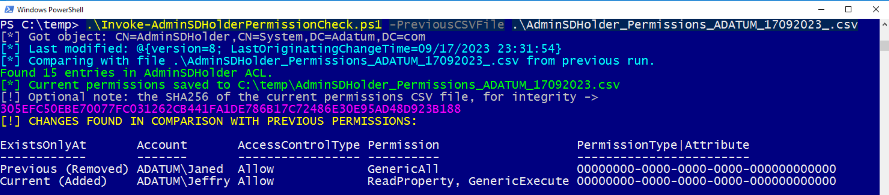
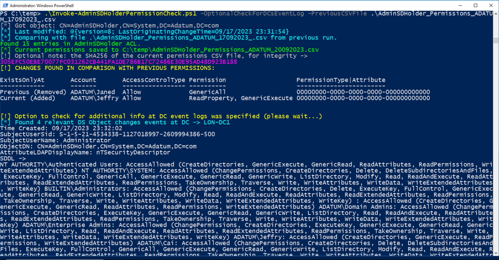

### Analyzes AdminSDHolder permissions &amp; compares with default installation baseline or a previous run, to detect potential backdoor/excessive persistent permission(s)
Does not require any special permissions to query and dump the permissions to CSV, as well as compare them. If option to check for additional info from DC event logs is specified, then requires 'Event Log Readers' or equivalent permission. Requires ActiveDirectory powershell module.  

.BACKGROUND
#### What is AdminSDHolder?
Essentially, it relates to a Security Descriptor on an AD system container. The Built-in privileged groups are protected by the AdminSDHolder DACL. 
It corresponds to the 16th char of dsHeuristics attribute (and governs the Privileged groups' members known mark of AdminCount=1). 
The ACL propagation is done by SDProp(agator) process. 
By default, SDProp runs on the PDC every 60 minutes. It can be triggered on-demand by setting RootDSE object with task ‘RunProtectAdminGroupsTask’=1 

.DESCRIPTION 
Analyzes AdminSDHolder ACL permissions & saves them, as well as checks for changes from a previous run. 
Can be useful for detecting a potential backdoor, and/or excessive & persistent permissions.
Can run without parameters to dump current permissions to CSV, or compare permissions with a previous run.
  
.PARAMETER PreviousCSVFile 
Full path to a CSV file from previous run of the script, to compare with the current online permissions of the AdminSDHolder object.
  
.PARAMETER OptionalCheckForDCsEventLog 
If specified, will also check for DC Security Event Logs (Requires 'Event Log Readers' permission or privileged).
  
.EXAMPLE 
.\Invoke-AdminSDHolderPermissionCheck.ps1  
Analyzes current AdminSDHolder ACL permissions from a live DC, shows the timestamp of the last update to AdminSDHolder ACL, saves permissions to a csv file, and compares them with a default baseline - showing the differences (e.g. Which permissions, if any, were added/removed).
  
.EXAMPLE 
.\Invoke-AdminSDHolderPermissionCheck.ps1 -PreviousCSVFile C:\temp\AdminSDHolder_Permissions_ADATUM_17092023.csv  
Analyzes current AdminSDHolder permissions & compares them with the data from the specified CSV file. Previous CSV must be from a previous run of this script, or with exact structure/headers.

 
.EXAMPLE 
.\Invoke-AdminSDHolderPermissionCheck.ps1 -PreviousCSVFile C:\temp\AdminSDHolder_Permissions_ADATUM_17092023.csv -OptionalCheckForDCsEventLog  
Analyzes current AdminSDHolder permissions & compares them with the data from the specified CSV file. Previous CSV must be from a previous run of this script, or with exact structure/headers.In addition, check Security event logs on DCs for additional information -e.g. who made the change for the ACL (Requires 'Event Log Readers' permission or other privileged).

